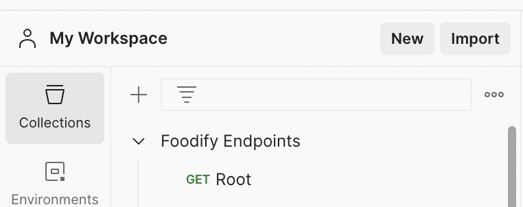
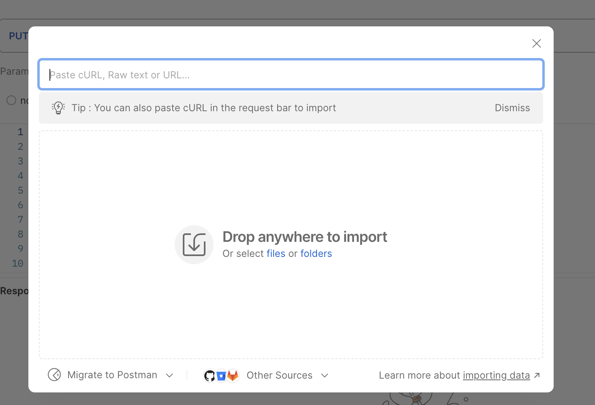

# Python Database Manager

## Features

- Manage "Users", "Restaurants", "Playlists" and "Reviews" collections (modifiable) on a Google Firebase Firestore NoSQL database.
- Add new users, restaurants or restaurant playlists.
- View all existing data in the collections.
- Update current information on the database.
- User input for manual insertion of data.
- Batch addition of data with CSV file.

## Description of Our Data Model

Our data model will be designed with a NoSQL type database. Our Foodify program will revolve around three main entities, users, restaurants, reviews and playlists, with the username attribute being the primary key for entities, users, restaurants, and playlists. The first entity is Users including attributes: username, email, firstName, and lastName (all of type string), playlists being an array of references to playlist objects where each playlist is referenced by a unique identifier, and lastly the points map, which is broken down into generalPoints, postPoints, and reviewPoints(all type int).

The restaurants entity includes 5 attributes of type maps. First being, contact which stores a collection of email, phone, and website of the restaurant. Next, dietaryOptions which stores 5 booleans of the restaurant specificities, that are: Kosher, halal, gluten free, vegan, or vegetarian. Also, the features entity is split into 6 additional booleans for other additional features that are also important, these are: Delivery, dinein, outdoor seating, parking , takeout, and wifi. Hours will give us the open and close timing of every day of the week in type string. Lastly, location of type map, stores the address divided into address, vity, country, postal code, state all of type string, and ofcourse the latitude and longitude of type geopoint. The restaurant entity is more complex, moreover the remaining attributes are mentioned in the Firestore database you can hover over it to see its type, this paragraph just briefly describes some of its attributes.

The Reviews entity includes attributes commentAuthor (type string), restaurantId (string), and review (string). The source attribute identifies where the review comes from, such as maps, reddit, or instagram. Lastly, the entity records a stars value (number), out of a score of 5.

Lasly, our last entity which is the playlists entity, which is designed to organize restaurant collections, similar to music playlists in a way. This entity has attributes like author (type: string), which gives us the user who created the playlist, description (type: string) that gives a brief overview of the playlist, and name (type: string), which specifies the title of the playlist. The restaurants attribute is an array of references, with each element pointing to a specific restaurant entity from our restaurant entity.

## Why we chose a NoSQL type database over SQL

Our entities contain numerous references to other entities, and a NoSQL database stores data as documents rather than in tables, making it easier to nest and access attributes. Since some attributes don't fit neatly into a fixed schema, we're working with unstructured data. For example, user reviews may vary in detail—some may include comments and ratings, while others may only have a rating. A NoSQL database is ideal for handling such variable data without needing a rigid schema.

## Prerequisites

- Python 3.13.0 or higher.
- pip (Python package manager)
- Google Firebase account

## Setup

1. Clone this repository: \
   `git clone https://github.com/ffang0224/ppds-team-5.git`

2. Navigate to the project directory:

```bash
cd path/to/ppds-team-5
```

3. Create a virtual environment (optional):

```python

python -m venv .venv

# On Windows:
.venv\Scripts\activate

# On macOS and Linux:
source .venv/bin/activate

```

4. Install dependencies: \
   `pip install -r requirements.txt`

5. Initialize a Firebase Firestore Instance and download credentials. \
   Add credentials to the root folder with the name _"firebase_credentials.json"_. Credentials can be found under **Project Settings -> Service Accounts**

## Script Usage

To run the script:
`python3 python_script/script.py`

Follow the prompts on screen to interact with the database:

```none
--- Restaurant, Playlist, and User Manager ---
1. Add a new restaurant manually
2. Add restaurants from CSV
3. Update a restaurant
4. Delete a restaurant
5. Read a restaurant
6. List all restaurants

7. Add a new playlist manually
8. Add playlists from CSV
9. Update a playlist
10. Delete a playlist
11. Read a playlist
12. List all playlists

13. Add a new user manually
14. Add users from CSV
15. Update a user
16. Delete a user
17. Read a user
18. List all users

19. Exit
Enter your choice (1-19):
```

## API

Our application provides API endpoints to manage users, reviews, playlists, and restaurants in the database. These endpoints allow adding new entries, updating existing ones, deleting entries, and retrieving information for all entities. Below are the key actions supported for each entity:

- **GET**: Retrieves an entry or lists all entries in the specified collection.

- **POST**: Adds a new entry to the database.

- **PUT**: Updates an existing entry in the database.

- **DELETE**: Deletes an entry from the database.

These actions allow full management of the entities within the database, providing flexibility in how users interact with and modify data.

To try it out, use the following command after installing `requirements.txt`:

```none
cd api
uvicorn app:app
```

After this, go to <http://127.0.0.1:8000/docs> to explore all the endpoints.

<br>
<br>

Sample data for Postman is included in the API folder. Import the JSON as raw text (just copy and paste into the field) on Postman and run the server to try the API endpoints.




## Contributing

Contributions to improve the application are welcome. Please feel free to submit a Pull Request.

## Licensing

Available under the [MIT License](https://opensource.org/license/mit).

